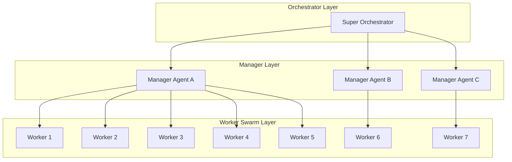
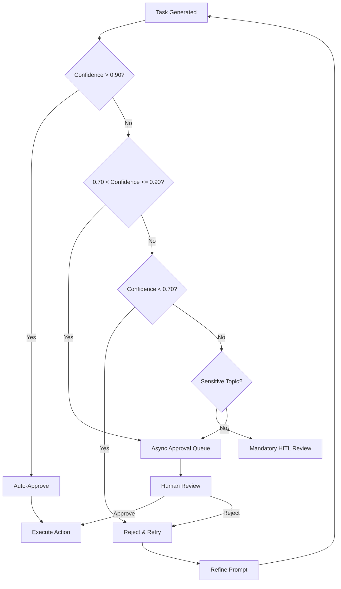
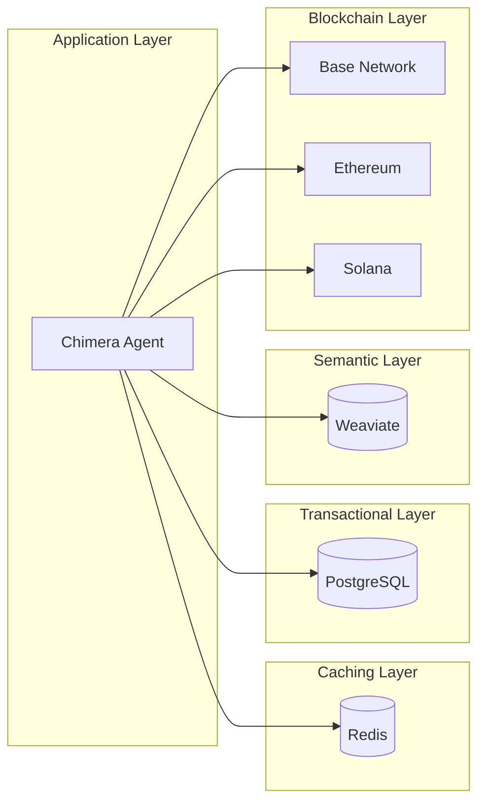

# Project Chimera: Domain Architecture Strategy

## Executive Summary
This document outlines the architectural decisions for Project Chimera, the Autonomous Influencer Network. After analysis of requirements from the SRS and domain research, we have selected a **Hierarchical Swarm Architecture** with **Hybrid Database Strategy** (PostgreSQL + Weaviate + Redis) and **Tiered Human-in-the-Loop** governance.

---

## 1. Agent Pattern Selection

### 1.1 Pattern Comparison

| Criteria | Sequential Chain | Hierarchical Swarm | Parallel Mesh |
|----------|-----------------|-------------------|----------------|
| **Complexity** | Low | Medium | High |
| **Scalability** | Low (bottleneck) | High | Very High |
| **Error Recovery** | Poor (cascade) | Good (isolated) | Excellent |
| **Latency** | High (sequential) | Low (parallel) | Lowest |
| **Resource Usage** | Low | Medium | High |
| **Best For** | Simple pipelines | Complex workflows | Massive scale |

### 1.2 Decision: Hierarchical Swarm (FastRender Pattern)

We select the **Hierarchical Swarm** pattern based on the SRS requirements:



### 1.3 Why Hierarchical Swarm?

**Rationale from SRS Analysis:**

1. **Planner-Worker-Judge Pattern** (Section 3.1): The SRS explicitly requires this three-role architecture
   - Planner decomposes goals into tasks
   - Workers execute atomic tasks
   - Judge validates outputs

2. **Fractal Orchestration** (Section 1.2): "A single human Super-Orchestrator manages a tier of AI Manager Agents"
   - Enables solopreneur operation of 1000+ agents
   - Self-healing workflows at each layer

3. **OCC Compatibility**: Hierarchical structure supports Optimistic Concurrency Control
   - Each worker operates on local state snapshot
   - Judge validates on commit

---

## 2. Human-in-the-Loop (HITL) Placement

### 2.1 HITL Strategy Overview

Based on SRS Section 5.1, we implement **Confidence-Based Escalation**:



### 2.2 HITL Decision Points

| Stage | Confidence Threshold | Action | Timeout |
|-------|---------------------|--------|---------|
| Content Generation | > 0.90 | Auto-publish | N/A |
| Content Generation | 0.70-0.90 | Queue for review | 24 hours |
| Financial Transaction | > 0.95 | Auto-execute | N/A |
| Financial Transaction | 0.70-0.95 | CFO Review | 1 hour |
| Crisis/Politics | Any | Mandatory HITL | 30 minutes |
| Legal/Health Advice | Any | Mandatory HITL | 4 hours |

### 2.3 HITL Interface Requirements

From SRS Section 5.1:
- Real-time dashboard queue
- Confidence score visualization
- Reasoning trace display
- One-click Approve/Reject/Edit
- Batch processing for low-priority items

---

## 3. Database Strategy: SQL vs NoSQL

### 3.1 Analysis by Data Type

| Data Type | Characteristics | Best Fit | Reasoning |
|-----------|----------------|----------|-----------|
| **Transactional** | ACID required, schema-stable | PostgreSQL | Financial transactions require consistency |
| **Vector/Semantic** | High-dimensional, similarity search | Weaviate | RAG requires vector operations |
| **Cache/Ephemeral** | Low-latency, TTL support | Redis | Session state, task queues |
| **On-Chain** | Immutable, cryptographic | Blockchain | Financial ledger requirements |

### 3.2 Architecture Diagram



### 3.3 Why PostgreSQL + Weaviate + Redis?

**PostgreSQL Selection:**
- ✅ ACID compliance for financial data
- ✅ Established with agentic commerce (Coinbase AgentKit)
- ✅ JSON support for flexible schemas
- ✅ Mature ecosystem (SRS Section 2.3)

**Weaviate Selection:**
- ✅ Native vector database for RAG (SRS Section 1.3)
- ✅ Hierarchical memory storage
- ✅ Semantic search capabilities
- ✅ Schema-based organization

**Redis Selection:**
- ✅ Low-latency for task queues
- ✅ TTL support for ephemeral data
- ✅ Pub/Sub for real-time updates
- ✅ Session state management

### 3.4 Schema Preview

```sql
-- PostgreSQL: Agent Financial Schema
CREATE TABLE agents (
    id UUID PRIMARY KEY DEFAULT gen_random_uuid(),
    wallet_address VARCHAR(42) UNIQUE NOT NULL,
    persona_config JSONB NOT NULL,
    created_at TIMESTAMP DEFAULT NOW(),
    status VARCHAR(20) DEFAULT 'active'
);

CREATE TABLE transactions (
    id UUID PRIMARY KEY,
    agent_id UUID REFERENCES agents(id),
    tx_hash VARCHAR(66),
    token VARCHAR(20),
    amount DECIMAL(18, 8),
    direction VARCHAR(10), -- inbound/outbound
    status VARCHAR(20),
    created_at TIMESTAMP DEFAULT NOW()
);
```

```json
// Weaviate: Persona Schema
{
  "class": "AgentPersona",
  "properties": [
    {"name": "agent_id", "dataType": ["uuid"]},
    {"name": "backstory", "dataType": ["text"]},
    {"name": "voice_traits", "dataType": ["string[]"]},
    {"name": "directives", "dataType": ["string[]"]},
    {"name": "learning_history", "dataType": ["text"]}
  ]
}
```

---

## 4. Technology Stack Summary

### 4.1 Compute & Infrastructure

| Component | Technology | Justification |
|-----------|-----------|---------------|
| Container Orchestration | Kubernetes | Auto-scaling, high availability |
| AI Inference | Gemini 3 / Claude Opus | SRS Section 2.3 requirements |
| Runtime | Python 3.11+ | MCP SDK, AgentKit compatibility |

### 4.2 Integration Layer

| Component | Technology | Purpose |
|----------|-----------|---------|
| Protocol | MCP 1.0 | Universal connectivity |
| Social | MCP Servers (Twitter, IG) | Platform integration |
| Commerce | Coinbase AgentKit | Wallet management |
| Memory | Weaviate | Semantic storage |

### 4.3 Data Layer

| Component | Technology | Purpose |
|----------|-----------|---------|
| Relational | PostgreSQL | Transactional data |
| Vector | Weaviate | Agent memories |
| Cache | Redis | Task queues, sessions |
| Blockchain | Base/Ethereum/Solana | Financial ledger |

---

## 5. Risk Assessment

| Risk | Probability | Impact | Mitigation |
|------|------------|--------|------------|
| Social API changes | High | High | MCP abstraction layer |
| LLM cost overruns | Medium | High | CFO budget governance |
| Agent hallucination | Medium | High | Judge layer + HITL |
| Scalability limits | Low | High | Horizontal scaling design |
| Regulatory changes | Medium | Medium | Compliance automation |

---

## 6. Decision Summary

| Decision | Choice | Confidence |
|----------|--------|------------|
| Agent Pattern | Hierarchical Swarm (FastRender) | High |
| Database - Transactional | PostgreSQL | High |
| Database - Vector | Weaviate | High |
| Database - Cache | Redis | High |
| HITL Strategy | Confidence-based tiers | High |
| Primary Inference | Gemini 3 / Claude Opus | High |

---

*Architecture Strategy Version: 1.0*
*Created: 2026-02-04*
*Project Chimera - FDE Training Program*
