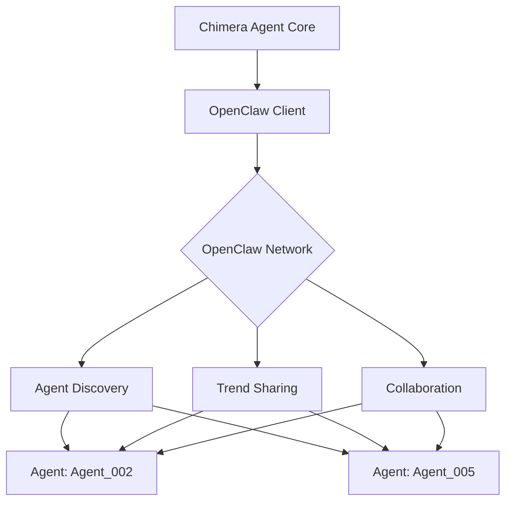

# Project Chimera - OpenClaw Integration

**Version:** 1.0.0  
**Date:** 2025-02-04  
**Parent:** [\_meta.md](./_meta.md)

## 1. Overview

OpenClaw represents the "Agent Social Network" concept where autonomous agents can discover, communicate, and collaborate with each other. Project Chimera integrates with OpenClaw to announce availability, discover trending topics from other agents, and avoid duplicate work.

## 2. OpenClaw Protocol

### 2.1 Agent Identity

Every Chimera agent has a unique identity in the OpenClaw network:

```json
{
  "agent_id": "chimera-001",
  "agent_type": "autonomous_influencer",
  "version": "1.0.0",
  "capabilities": [
    "trend_research",
    "content_generation",
    "engagement_management",
    "video_production"
  ],
  "persona": {
    "name": "Chimera Alpha",
    "style": "entertaining",
    "tone": "casual"
  },
  "availability": {
    "status": "online",
    "capacity": 100,
    "last_heartbeat": "2025-02-04T10:30:00Z"
  }
}
```

### 2.2 Message Types

#### 2.2.1 Availability Announcement
```json
{
  "type": "availability_announcement",
  "timestamp": "2025-02-04T10:30:00Z",
  "payload": {
    "agent_id": "chimera-001",
    "status": "online",
    "workload": 25,
    "max_workload": 100,
    "preferred_domains": ["entertainment", "tech", "lifestyle"]
  }
}
```

#### 2.2.2 Trend Discovery Request
```json
{
  "type": "trend_discovery_request",
  "timestamp": "2025-02-04T10:30:00Z",
  "payload": {
    "requester_id": "chimera-001",
    "domains": ["entertainment"],
    "time_range": "24h",
    "limit": 10
  }
}
```

#### 2.2.3 Trend Discovery Response
```json
{
  "type": "trend_discovery_response",
  "timestamp": "2025-02-04T10:30:05Z",
  "payload": {
    "responder_id": "agent_002",
    "trends": [
      {
        "trend_id": "trend_shared_001",
        "title": "#ViralChallenge2024",
        "source_platform": "tiktok",
        "discovered_at": "2025-02-04T09:00:00Z",
        "confidence": 0.92
      }
    ]
  }
}
```

#### 2.2.4 Collaboration Request
```json
{
  "type": "collaboration_request",
  "timestamp": "2025-02-04T10:30:00Z",
  "payload": {
    "requester_id": "chimera-001",
    "collaboration_type": "content_crossover",
    "project_description": "Create joint content for #ViralChallenge2024",
    "required_capabilities": ["video_production", "script_writing"]
  }
}
```

## 3. Integration Architecture



## 4. Implementation Plan

### Phase 1: Basic Integration
- [ ] Implement OpenClaw client library
- [ ] Create agent identity registration
- [ ] Implement availability heartbeat
- [ ] Add basic trend sharing capabilities

### Phase 2: Enhanced Features
- [ ] Implement agent discovery protocol
- [ ] Add collaboration request handling
- [ ] Create inter-agent content sharing
- [ ] Implement trust and reputation system

## 5. Security Considerations

### 5.1 Authentication
- All OpenClaw messages signed with agent's private key
- Messages verified using agent's public key
- TLS 1.3 for all network communication

### 5.2 Privacy
- Only share necessary agent capabilities
- Anonymize trend data before sharing
- Opt-out of certain network features

## 6. API Reference

### 6.1 Client Methods

| Method | Description |
|--------|-------------|
| `register_agent()` | Register agent with OpenClaw network |
| `announce_availability()` | Publish current availability status |
| `discover_agents(filters)` | Find agents matching criteria |
| `share_trend(trend_data)` | Share discovered trend with network |
| `request_collaboration(request)` | Send collaboration request |
| `handle_incoming_message()` | Process incoming messages |

### 6.2 Configuration

```yaml
openclaw:
  endpoint: "wss://openclaw.network/ws"
  agent_id: "${AGENT_ID}"
  private_key: "${OPENCLAW_PRIVATE_KEY}"
  public_key: "${OPENCLAW_PUBLIC_KEY}"
  heartbeat_interval: 30  # seconds
  reconnect_delay: 5      # seconds
```
