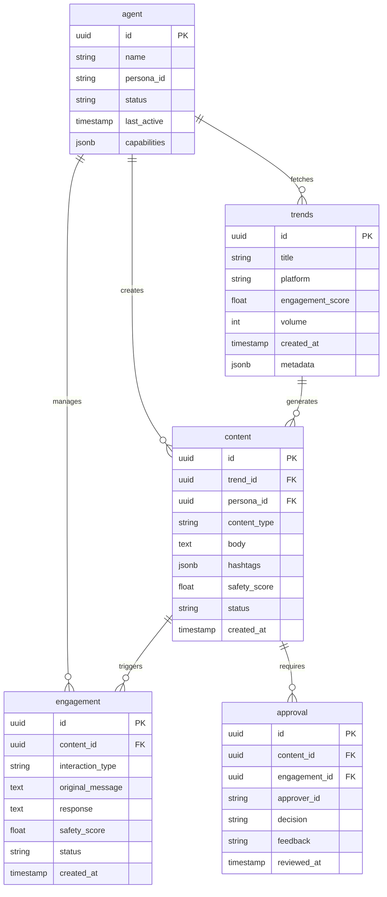

# Project Chimera - Technical Specifications

**Version:** 1.0.0  
**Date:** 2025-02-04  
**Parent:** [\_meta.md](./_meta.md)

## 1. Architecture Overview

```
┌─────────────────────────────────────────────────────────────────┐
│                      Chimera Agent Core                        │
├─────────────────────────────────────────────────────────────────┤
│  ┌──────────────┐  ┌──────────────┐  ┌──────────────┐        │
│  │ Trend Fetcher│  │Content Gen   │  │ Engagement   │        │
│  │   Service    │  │   Service    │  │   Manager    │        │
│  └──────┬───────┘  └──────┬───────┘  └──────┬───────┘        │
│         │                 │                 │                 │
│  ┌──────┴─────────────────┴─────────────────┴───────┐        │
│  │              Agent Orchestrator                  │        │
│  │         (Hierarchical Swarm Pattern)              │        │
│  └──────┬────────────────────────────────────┬───────┘        │
│         │                                    │                 │
│  ┌──────┴───────┐                  ┌────────┴───────┐        │
│  │ Safety Layer │                  │ OpenClaw       │        │
│  │(Human-in-Loop)│                 │ Integration    │        │
│  └──────────────┘                  └────────────────┘        │
└─────────────────────────────────────────────────────────────────┘
         │                                    │
┌────────┴────────┐               ┌───────────┴───────────┐
│   PostgreSQL    │               │   External APIs       │
│   (Metadata)    │               │   (TikTok, YT, X)    │
└─────────────────┘               └───────────────────────┘
```

## 2. API Contracts

### 2.1 Trend Fetcher Service

**Endpoint:** `POST /api/v1/trends/fetch`

**Request:**
```json
{
  "platforms": ["tiktok", "youtube", "twitter"],
  "category": "entertainment",
  "limit": 10,
  "time_range": "24h"
}
```

**Response:**
```json
{
  "status": "success",
  "data": {
    "trends": [
      {
        "id": "trend_001",
        "title": "#ViralChallenge2024",
        "platform": "tiktok",
        "engagement_score": 0.95,
        "volume": 1500000,
        "created_at": "2025-02-04T10:30:00Z",
        "metadata": {
          "hashtags": ["#ViralChallenge2024"],
          "sentiment": "positive",
          "demographics": {
            "age_range": "18-24",
            "location": "US"
          }
        }
      }
    ]
  },
  "timestamp": "2025-02-04T10:30:05Z"
}
```

### 2.2 Content Generator Service

**Endpoint:** `POST /api/v1/content/generate`

**Request:**
```json
{
  "trend_id": "trend_001",
  "content_type": "post",
  "persona_id": "persona_001",
  "variations": 3,
  "safety_check": true
}
```

**Response:**
```json
{
  "status": "success",
  "data": {
    "content": [
      {
        "id": "content_001",
        "text": "Just tried the #ViralChallenge2024! 🔥",
        "hashtags": ["#ViralChallenge2024", "#ChimeraAI"],
        "safety_score": 0.98,
        "status": "pending_approval"
      }
    ]
  }
}
```

### 2.3 Engagement Manager Service

**Endpoint:** `POST /api/v1/engagement/respond`

**Request:**
```json
{
  "interaction_id": "int_001",
  "interaction_type": "comment",
  "message": "This is amazing! Love your content!",
  "context": {
    "previous_interactions": 5,
    "user_follower_count": 500
  }
}
```

**Response:**
```json
{
  "status": "success",
  "data": {
    "response": {
      "id": "response_001",
      "text": "Thank you so much! 😊 Glad you enjoyed it!",
      "safety_score": 0.99,
      "status": "pending_approval"
    }
  }
}
```

## 3. Database Schema (PostgreSQL)

### 3.1 Entity Relationship Diagram



### 3.2 Table Definitions

```sql
-- Trends Table
CREATE TABLE trends (
    id UUID PRIMARY KEY DEFAULT gen_random_uuid(),
    title VARCHAR(255) NOT NULL,
    platform VARCHAR(50) NOT NULL,
    engagement_score DECIMAL(3,2) NOT NULL,
    volume INTEGER NOT NULL,
    metadata JSONB DEFAULT '{}',
    created_at TIMESTAMP WITH TIME ZONE DEFAULT NOW()
);

-- Content Table
CREATE TABLE content (
    id UUID PRIMARY KEY DEFAULT gen_random_uuid(),
    trend_id UUID REFERENCES trends(id),
    persona_id UUID NOT NULL,
    content_type VARCHAR(50) NOT NULL,
    body TEXT,
    hashtags JSONB DEFAULT '[]',
    safety_score DECIMAL(3,2),
    status VARCHAR(20) DEFAULT 'draft',
    created_at TIMESTAMP WITH TIME ZONE DEFAULT NOW()
);

-- Engagement Table
CREATE TABLE engagement (
    id UUID PRIMARY KEY DEFAULT gen_random_uuid(),
    content_id UUID REFERENCES content(id),
    interaction_type VARCHAR(50) NOT NULL,
    original_message TEXT,
    response TEXT,
    safety_score DECIMAL(3,2),
    status VARCHAR(20) DEFAULT 'pending',
    created_at TIMESTAMP WITH TIME ZONE DEFAULT NOW()
);

-- Approval Table
CREATE TABLE approval (
    id UUID PRIMARY KEY DEFAULT gen_random_uuid(),
    content_id UUID REFERENCES content(id),
    engagement_id UUID REFERENCES engagement(id),
    approver_id VARCHAR(255) NOT NULL,
    decision VARCHAR(20) NOT NULL,
    feedback TEXT,
    reviewed_at TIMESTAMP WITH TIME ZONE DEFAULT NOW()
);

-- Indexes
CREATE INDEX idx_trends_platform ON trends(platform);
CREATE INDEX idx_trends_created_at ON trends(created_at DESC);
CREATE INDEX idx_content_status ON content(status);
CREATE INDEX idx_content_trend_id ON content(trend_id);
CREATE INDEX idx_engagement_content_id ON engagement(content_id);
```

## 4. Skill Contracts

### 4.1 skill_download_video
**Input:** `{ "url": "https://...", "platform": "tiktok" }`  
**Output:** `{ "filepath": "/tmp/video.mp4", "metadata": {...} }`

### 4.2 skill_transcribe_audio
**Input:** `{ "filepath": "/tmp/video.mp4" }`  
**Output:** `{ "transcript": "...", "duration": 120.5 }`

### 4.3 skill_generate_caption
**Input:** `{ "transcript": "...", "persona": "funny", "platform": "tiktok" }`  
**Output:** `{ "caption": "...", "hashtags": ["#..."] }`

### 4.4 skill_post_content
**Input:** `{ "content": {...}, "platform": "tiktok" }`  
**Output:** `{ "post_id": "...", "url": "...", "status": "posted" }`

## 5. Environment Variables

| Variable | Description | Required |
|----------|-------------|----------|
| DATABASE_URL | PostgreSQL connection string | Yes |
| TIKTOK_API_KEY | TikTok Research API key | Yes |
| YOUTUBE_API_KEY | YouTube Data API key | Yes |
| TWITTER_API_KEY | Twitter API v2 bearer token | Yes |
| OPENAI_API_KEY | OpenAI API key | Yes |
| OPENCLAW_ENDPOINT | OpenClaw network endpoint | Yes |
| SAFETY_LAYER_ENDPOINT | Human review service URL | Yes |
